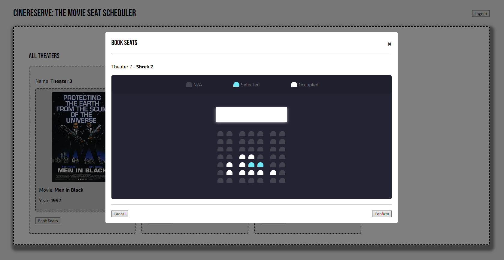

# CineReserve - Movie Seat Scheduler

## Description

CineReserve is a web application designed to manage movie theaters, allowing users to reserve seats for various movies. This project aims to provide a user-friendly interface for both administrators and regular users to interact with the system efficiently.

## Features

- **User Authentication**: Supports user login and signup functionalities.
- **Theater Management**: Admins can add, edit, and delete theater information, including seating arrangements.
- **Movie Management**: Admins can add, edit, and delete movie details associated with each theater.
- **Seat Reservation**: Users can book seats for movies showing in the theaters.

## Technologies Used

- **Frontend**: HTML, CSS, JavaScript
- **Backend**: Firebase Realtime Database for data storage
- **Authentication**: Firebase Authentication for user authentication

## Project Structure

- **src/**
  - **css/**: Contains CSS files for styling.
    - `login.css`: Styles for the login/signup page.
    - `modal.css`: Styles for modal components.
    - `spinner.css`: Styles for the spinner component.
    - `style.css`: General styles for the application.
    - `theatre-display.css`: Styles specific to the theater display page.
  - **js/**
    - **controllers/**: Contains JavaScript files for controlling different aspects of the application.
      - `theaterController.js`: Controls theater-related functionality.
      - `userController.js`: Controls user-related functionality.
    - **models/**: Contains JavaScript files defining data models used in the application.
      - `theaterModel.js`: Defines the theater data model.
      - `userModel.js`: Defines the user data model.
    - **views/**: Contains JavaScript files for rendering different views in the application.
      - **modals/**: Contains JavaScript files for modal components used in the application.
        - `addMovieModal.js`: Modal for adding a movie to a theater.
        - `addTheaterModal.js`: Modal for adding a new theater.
        - `bookSeatsModal.js`: Modal for booking seats in a theater.
        - `changeMovieModal.js`: Modal for changing the movie in a theater.
        - `deleteTheaterModal.js`: Modal for deleting a theater.
        - `editTheaterModal.js`: Modal for editing theater details.
        - `errorModal.js`: JavaScript file for handling error modals.
        - `modal.js`: Base modal class providing common functionality.
      - `theaterView.js`: JavaScript file for rendering theater-related views.
    - `config.js`: Configuration file for Firebase and API keys.
    - `firebase.js`: Contains Firebase initialization code.
    - `helpers.js`: Helper functions used throughout the application.
  - **img/**: Contains image assets used in the application.
- **data.json**: JSON file containing sample data for the application.
- **index.html**: Main HTML file for the application.
- **login.html**: HTML file for the login/signup page.

## Application Architecture

The application follows the Model-View-Controller (MVC) pattern, which separates the codebase into three main components:

- **Models**: Represent the data and its logic. Located in `js/models/`, they define the structure and behavior of different data entities, such as theaters and users.

- **Views**: Responsible for displaying the data to users and handling user input. Found in `js/views/`, views render the interface elements and interact with users.

- **Controllers**: Act as intermediaries between models and views. Located in `js/controllers/`, controllers manage user actions, update data in models, and update views accordingly.

By using MVC, the codebase remains organized and modular, facilitating easier understanding, maintenance, and scalability. Each component has a specific responsibility, promoting code reusability and making it easier to add new features or make changes without affecting other parts of the application.

## How to Run the Project

1. Clone the repository to your local machine.
2. Navigate to the project directory.
3. Set up your [Firebase database](https://console.firebase.google.com) by creating a new Firebase project and filling in the `FIREBASE_CONFIG` object in the `config.js` file with your Firebase project configuration.
4. Obtain an API key from [OMDB API](https://www.omdbapi.com/) and add it to the `API_KEY` constant in the `config.js` file.
5. When a user is created, add their user ID as the `ADMIN_ID` constant in the `config.js` file to grant them admin privileges.
6. Import `data.json` into your Firebase Realtime Database to populate initial data if desired.
7. Open `index.html` in a web browser to access the main application.

## Getting Started

- **User Authentication**:
  - New users can easily sign up for an account or log in with existing credentials.
- **Admin Actions**:
  - Administrators gain access to theater management features after logging in.
- **User Actions**:
  - Regular users have the ability to browse theaters, check movie schedules, and reserve seats for screenings.
